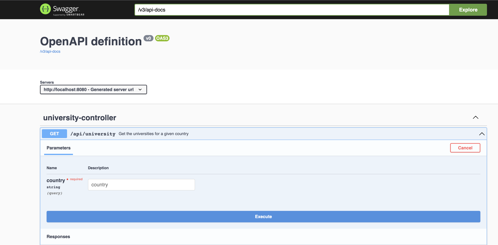
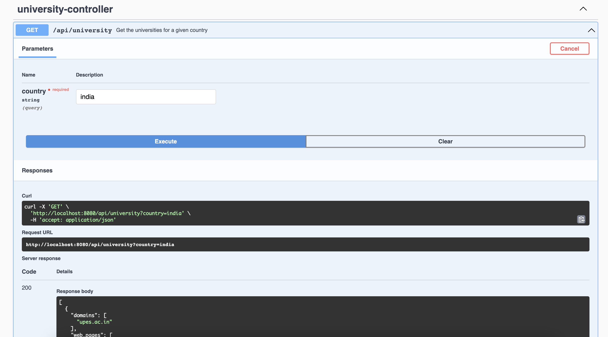
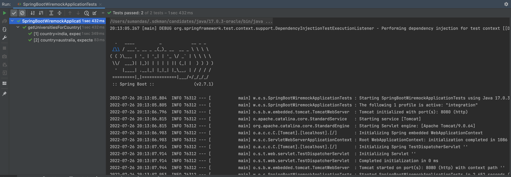

# Sample Spring Boot application with WireMock

The purpose of this project is to demonstrate how we can
use Spring Boot along with [WireMock](https://wiremock.org/docs/)
and [JUnit 5](https://junit.org/junit5/docs/current/user-guide/#overview-what-is-junit-5) to perform
Integration Testing with mocking external REST API calls.

# How to build and run

project can be compiled with JDK 17 and above `javac`.

To compile just do `mvn clean package`.

Spring Boot Version : 2.7.1

## Prerequisites

* JAVA 17 should be installed
* Maven should be installed

**Note** : Here, we are using one of the free API listed in [Apipheny](https://apipheny.io/free-api/) for demonstration
purposes.
We will use the [Universities](https://github.com/Hipo/university-domains-list) List API to get a list of universities
in a specified country. For this tutorial, we can
fetch the list
of universities for any country (turkey, india and australia). We will not be validating the data in the response.

To run the application execute the below command :

```
java -jar target/spring-boot-wiremock*.jar
```

The server will start at <http://localhost:8080>.

Once the application starts, The Swagger UI will open at : <http://localhost:8080/swagger-ui/index.html> .

We can now use the Swagger-UI to test our application.





for more detailed technical information please check my
post : [Testing Spring Boot Application using WireMock and JUnit 5](https://dassum.medium.com/testing-spring-boot-application-using-wiremock-and-junit-5-d514a47ab931)

## Exploring the Rest APIs

The application contains the following REST API

```
1. GET /api/university - Get the universities for a given country
```

```
curl -X 'GET' \
  'http://localhost:8080/api/university?country=india' \
  -H 'accept: application/json'

```

Run the Integration tests.



